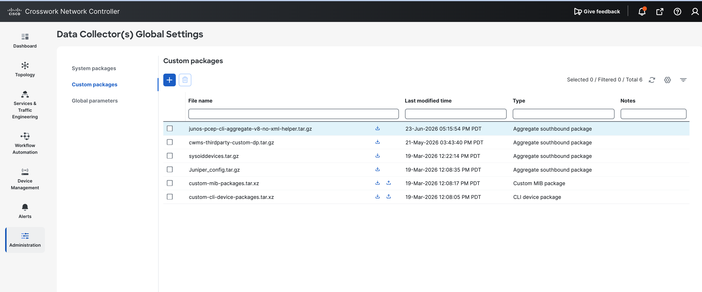
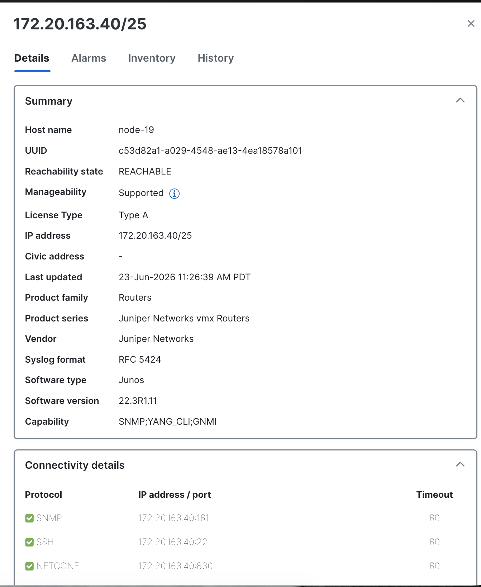

# CNC 7.2 Multivendor Service Health Heuristic Package - Junos

This repository contains a Cisco Crosswork Network Controller 7.2 custom Service Health heuristic package for an L3VPN service with IOS XR and Junos provider-edge nodes.

The package was built and validated for the `VPN-4003` lab service. The main use case is extending CNC Service Health so a Junos PE, `node-19`, can participate in the same L3VPN assurance graph as IOS XR nodes.

The repository includes:

- A custom CNC Service Health heuristic package export.
- A Junos PCEP Data Collector aggregate CLI package.
- Custom HP rules, subservices, metrics, and plugin logic for multivendor L3VPN service health.


## Repository Contents

```text
.
|-- README.md
|-- custom-hp-172.20.163.27-2026-06-24/
|   `-- custom/
|       |-- ConfigProfile/
|       |-- MetricClass/
|       |-- Plugin/
|       |-- RuleClass/
|       `-- SubserviceClass/
`-- junos-pcep-cli-aggregate-v8-no-xml-helper.tar.gz
```

## Package Summary

| Package | Type | Purpose |
| --- | --- | --- |
| `custom-hp-172.20.163.27-2026-06-24/custom/` | CNC Service Health heuristic package content | Custom L3VPN rule, subservice, metric, and plugin definitions for IOS XR plus Junos service health. |
| `junos-pcep-cli-aggregate-v8-no-xml-helper.tar.gz` | CNC Data Collector aggregate southbound package | Adds a Junos CLI parser for `show path-computation-client active-pce`, used by the custom PCEP health metrics. |

## Heuristic Package Scope

The custom HP extends L3VPN Service Health for:

- VPN node summary.
- Interface operational state and packet error/discard counters.
- VRF route health.
- eBGP neighbor health inside the VPN.
- Provider BGP neighbor health.
- Device CPU and memory health.
- PCEP session health.
- Optional IOS XR dynamic SR policy health.
- Optional IOS XR SR-PM/probe health where supported.

The final L3VPN node rule is:

```text
Rule-L3VPN-NM-VPN-Node custom
```

It builds this node-level health graph:

```text
subservice.l3vpn.vpn.node.summary custom
|-- subservice.interface.health custom
|-- subservice.vrf.route.health custom
|   `-- subservice.ebgp.nbr.health custom
|-- subservice.bgp.nbr.health custom
|-- subservice.pcep.session.health custom
|-- subservice.dynamic.l3vpn.sr.policy custom
`-- subservice.device.health custom
```

## Custom HP Directory

The expanded HP export is in:

```text
custom-hp-172.20.163.27-2026-06-24/custom/
```

It contains:

| Directory | Description |
| --- | --- |
| `ConfigProfile/` | L3VPN monitoring profiles such as `Gold_L3VPN_ConfigProfile custom` and threshold values. |
| `MetricClass/` | Metric definitions and platform-specific collection methods. |
| `Plugin/` | Custom Python extraction logic, especially `l3vpn_plugin.py`. |
| `RuleClass/` | L3VPN service and VPN node matching rules. |
| `SubserviceClass/` | Subservice health expressions and metric dependencies. |

If CNC requires a compressed HP upload artifact, package the expanded HP directory so the archive contains the top-level `custom/` folder:

```bash
tar -czf custom-hp-172.20.163.27-2026-06-24.tar.gz \
  -C custom-hp-172.20.163.27-2026-06-24 \
  custom
```

Then import the resulting tarball from the CNC Heuristic Packages page or through the HP import API.

## Junos PCEP CLI Package

File:

```text
junos-pcep-cli-aggregate-v8-no-xml-helper.tar.gz
```

Archive layout:

```text
cli/
cli/custom-cli-device-packages/
cli/custom-cli-device-packages/yang/
cli/custom-cli-device-packages/xar/
cli/custom-cli-device-packages/xar/junosPcepShowPathComputationXMLv8.xar
cli/custom-cli-device-packages/yang/junosPcepShowPathComputationXMLv8.yang
```

This is a CNC Data Collector aggregate southbound package. Upload it from:

```text
Administration > Data Collector(s) Global Settings > Custom packages
```

Select:

```text
Type: Aggregate package
```

The screenshot below shows the package uploaded in CNC as an aggregate southbound package:



The package enables Junos collection for:

```text
show path-computation-client active-pce
```

The custom HP PCEP metrics reference this package through:

```text
devicePackageName: showPathComputationXML
functionName: showPathComputationXML
```

## Key Junos Fixes Included

### Junos Device Type Matching

The HP matchers use:

```text
os_model: Junos
```

This matters because CNC/DLM discovered the device as `Junos`, not `JUNOS`.

For node-19, the DLM inventory details showed:

```text
Host name: node-19
IP address: 172.20.163.40/25
Vendor: Juniper Networks
Product series: Juniper Networks vmx Routers
Software type: Junos
Software version: 22.3R1.11
Capability: SNMP;YANG_CLI;GNMI
```

The screenshot below highlights the inventory view where CNC reports software type as `Junos`:



### OpenConfig Origin Prefix

For CNC 7.2, OpenConfig HP sensor paths include the origin prefix:

```text
openconfig:network-instances/...
```

Example:

```text
openconfig:network-instances/network-instance[name=master]/protocols/protocol/bgp/neighbors/neighbor/state/neighbor-address
```

The broader subscription path uses:

```text
openconfig:network-instances/network-instance/protocols/protocol/bgp/neighbors/neighbor
```

### Junos Interface Name Resolution

The service model can carry a service-side interface label that does not match the actual Junos interface. For example, the service health symptom originally used:

```text
HundredGigE0/0/3.4003
```

The real Junos interface was:

```text
et-0/0/3.4003
```

The custom plugin `custom/Plugin/l3vpn_plugin.py` resolves the real interface from generated device configuration:

```text
configuration/interfaces/interface/name
configuration/interfaces/interface/unit/name
configuration/routing-instances/instance/interface/name
```

The interface health subservice then receives:

```text
device = node-19
ifId = et-0/0/3.4003
interfaceId = et-0/0/3
subInterfaceId = 4003
```

### Junos IF-MIB Mapping

Junos interface operational state uses SNMP IF-MIB:

```text
IF-MIB/ifTable/ifEntry[ifName={interfaceId}.{subInterfaceId}]/ifOperStatus
```

The metric maps:

```text
1 -> up
2 -> down
7 -> down
```

The value `7` represents `lowerLayerDown` and is treated as `down` so CNC reports a real degraded symptom instead of leaving the state unknown.

## Metric Coverage

### Interface Health

| Metric | Junos collection |
| --- | --- |
| `metric.interface.oper custom` | SNMP IF-MIB `ifOperStatus` by Junos `ifName`. |
| `metric.interface.in.errors custom` | SNMP IF-MIB `ifInErrors`; OpenConfig counter implementation also exists. |
| `metric.interface.out.errors custom` | SNMP IF-MIB `ifOutErrors`; OpenConfig counter implementation also exists. |
| `metric.interface.in.discards custom` | SNMP IF-MIB `ifInDiscards`; OpenConfig counter implementation also exists. |
| `metric.interface.out.discards custom` | SNMP IF-MIB `ifOutDiscards`; OpenConfig counter implementation also exists. |

### BGP Health

| Metric | Junos collection |
| --- | --- |
| `metric.bgp.neighbors.ipaddr.list custom` | OpenConfig BGP neighbor address list under `network-instance[name=master]`. |
| `metric.bgp.session.state custom` | OpenConfig BGP session state for default/master network instance. |
| `metric.bgp.vrf.session.state custom` | OpenConfig BGP session state under `network-instance[name={vrf}]`. |

### VRF Route Health

| Metric | Junos collection |
| --- | --- |
| `metric.route.vrf.bgp custom` | OpenConfig BGP `global/state/total-prefixes` under the VPN network instance. |
| `metric.route.vrf.connected custom` | OpenConfig BGP `global/state/total-prefixes` under the VPN network instance. |
| `metric.route.vrf.local custom` | OpenConfig BGP `global/state/total-prefixes` under the VPN network instance. |

Note: IOS XR exposes separate local, connected, and BGP RIB protocol counters through native models. The Junos OpenConfig implementation in this HP uses an available BGP prefix signal to avoid feed errors, but it is not a perfect semantic equivalent of the IOS XR RIB counter split.

### Device Health

| Metric | Junos collection |
| --- | --- |
| `metric.device.cpu.load custom` | SNMP `JUNIPER-MIB/jnxOperating1MinAvgCPU`; OpenConfig CPU implementation also exists. |
| `metric.device.memory.free custom` | OpenConfig `components/component[name=Routing Engine0]/state/memory/available`. |

### PCEP Health

| Metric | Junos collection |
| --- | --- |
| `metric.sr.te.pcc.peer.addrs custom` | CLI package parsing `show path-computation-client active-pce`, exact output path `routedetails/routelearnt/pce-ip`. |
| `metric.sr.te.pcc.peer.state custom` | CLI package parsing `show path-computation-client active-pce`, exact output path `routedetails/routelearnt/pce-status`. |

The PCEP state metric maps:

```text
PCE_STATE_UP -> up
```

### IOS XR-Only Metrics

The HP retains IOS XR-only implementations for:

- SR policy PM delay.
- SR policy PM variance.
- SR policy PM packet counters.
- SR policy liveness state.
- PCC-initiated SR policy admin/oper state.
- Dynamic SR policy list from IOS XR BGP VPN route CLI.

Junos does not expose the same IOS XR SR-PM operational model, so these checks are not treated as Junos equivalents.

## Import Order

Recommended import sequence:

1. Stop monitoring for the target L3VPN service.
2. Upload `junos-pcep-cli-aggregate-v8-no-xml-helper.tar.gz` as a Data Collector aggregate package.
3. Import the custom HP content from `custom-hp-172.20.163.27-2026-06-24/custom/`.
4. Confirm the Junos device in DLM uses the expected gNMI port and encoding.
5. Start monitoring for the L3VPN service.
6. Poll service health until subservices move out of `MONITORING_INITIATED`.
7. Check active symptoms and metric scheduler jobs for feed errors.

## gNMI Validation Example

Validate Junos OpenConfig data directly before debugging CNC:

```bash
gnmic -a <junos-mgmt-ip>:32767 \
  -u <user> -p <password> \
  --insecure \
  --timeout 5m \
  --encoding JSON_IETF \
  subscribe \
  --path /openconfig-network-instance:network-instances/network-instance[name=master]/protocols/protocol/bgp/neighbors/neighbor/state/neighbor-address \
  --mode once
```

If the same path works with `gnmic` but CNC reports `Unable to get feed`, check:

- DLM device type and software version.
- gNMI port.
- gNMI encoding, for example `JSON_IETF` or `PROTO`.
- Whether the HP path includes the origin prefix expected by CNC 7.2.
- Whether the metric is supported for the platform.

## Common Errors and Fixes

| Error | Likely cause | Fix |
| --- | --- | --- |
| `Device node-19 not found in DLM inventory or does not have required information` | Device inventory missing software type, software version, or capability data. | Fix DLM inventory and confirm software type is `Junos`. |
| `Unable to get feed from device for metric.bgp...` | gNMI path, origin, encoding, or collector validation mismatch. | Use `openconfig:` HP paths and verify with `gnmic`. |
| `Unable to get feed from device for metric.interface...` | Service interface label does not match Junos operational `ifName`. | Use plugin-resolved `interfaceId` and `subInterfaceId`. |
| `Unable to get feed from device for metric.sr.te.pcc.peer.addrs` | Junos PCEP collection package missing or not matched. | Upload the aggregate CLI package and restart monitoring. |
| Data Collector upload says archive has no top-level collector directory | Aggregate package layout is wrong. | Ensure the archive contains top-level `cli/`. |
| Data Collector upload says extension must be `.tar.gz` | Wrong archive format. | Upload `.tar.gz` for aggregate package. |

## Validation Target

For `VPN-4003`, the expected result is that Junos `node-19` service health moves from collection failures to meaningful service symptoms.

For example, if the router reports:

```text
show interfaces et-0/0/3.4003
Flags: Device-Down
```

Then CNC should show a real degraded symptom such as:

```text
VPN Interface et-0/0/3.4003 Operational status is not up.
```

That is a correct service health outcome. It means CNC collected the metric and evaluated the health expression, rather than failing to collect the feed.

## Related Blog Draft

A longer XRdocs-style explanation of the lab, service provisioning, route policy, SR-TE ODN behavior, verification steps, and metric design was prepared separately during this work. This repository is focused on the package artifacts and operational README.
